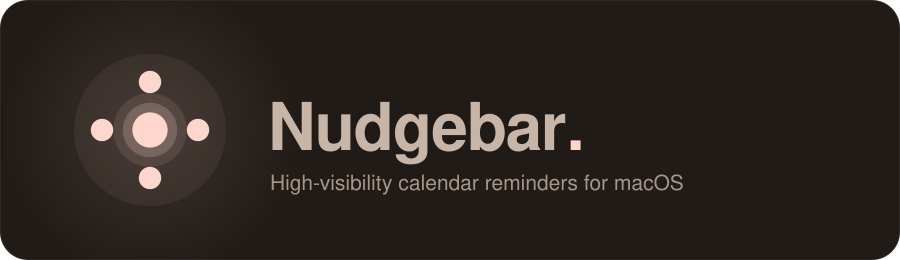
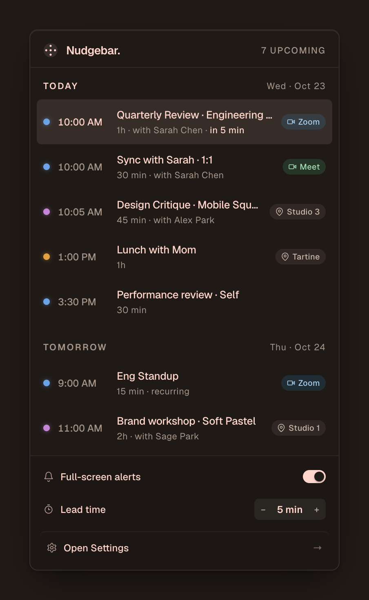
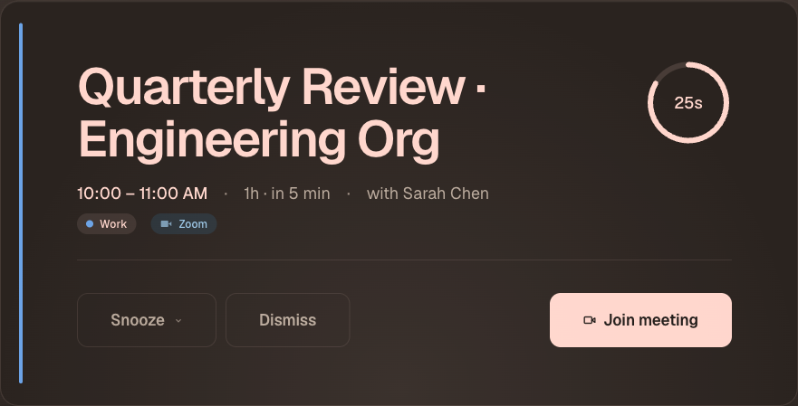
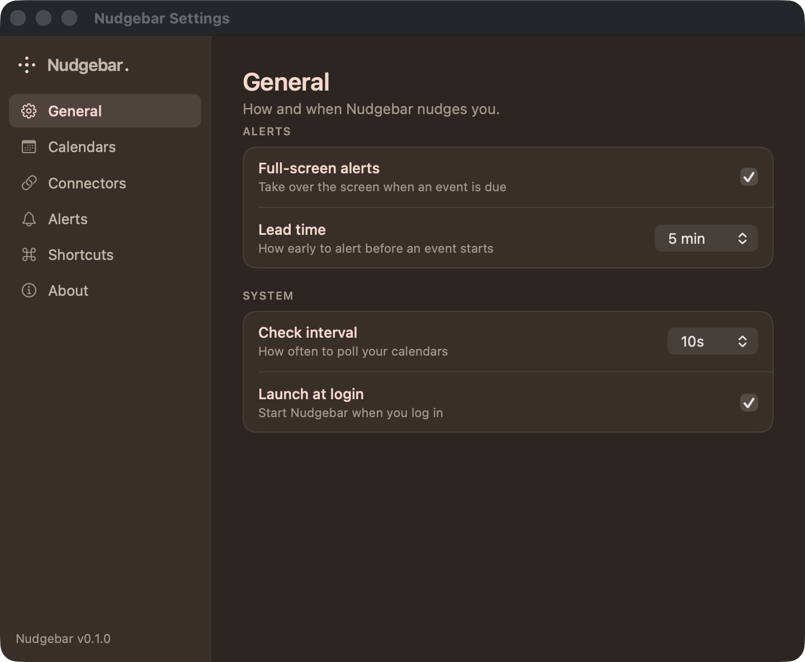

<p align="center">
  
</p>

<p align="center">
  
  
  <a href="https://github.com/mikec-git/nudgebar/actions/workflows/ci.yml"></a>
  <a href="LICENSE"></a>
  
</p>

<p align="center">
  High-visibility, hard-to-miss menu-bar reminders for macOS - so you actually show up.
</p>

---

### Your day at a glance

<table>
<tr>
<td width="58%" valign="top">

The menu-bar popover leads with your next event or two (one-tap **Join** for video calls), then a compact **Today / Tomorrow** timeline. Per-calendar colors, `in 5 min` pills, and clickable links. The status item counts down to what's next.

</td>
<td width="42%" valign="top"></td>
</tr>
</table>

### Impossible to miss

<table>
<tr>
<td width="52%" valign="top"></td>
<td width="48%" valign="top">

When an event is due, a full-screen card takes over: countdown ring, **Snooze** (capped to the time left), **Dismiss**, **Join**, and a looping sound. Press **Esc** to clear, or **Snooze / Dismiss All** when they stack.

</td>
</tr>
</table>

### Tuned your way

<table>
<tr>
<td width="58%" valign="top">

Per-calendar rules, alert sounds, lead time, all-day alerts, auto-dismiss, global shortcuts, and launch at login. Reads **EventKit** (Google / Outlook / iCloud via macOS) plus **Calendly** and **Cal.com** connectors - and re-arms alerts when events move.

</td>
<td width="42%" valign="top"></td>
</tr>
</table>

## Install

Build from source (macOS 13+, Swift 6 / Xcode 16):

```sh
git clone https://github.com/mikec-git/nudgebar.git
cd nudgebar && make package && open dist/Nudgebar.app
```

Grant Calendar access on first launch. Homebrew is planned - `brew install --cask mikec-git/tap/nudgebar` ([cask scaffold](packaging/homebrew/nudgebar.rb)); the build isn't notarized yet, so first launch needs a right-click -> **Open**.

## Develop

```sh
make swift-test      # 127 tests
swift run Nudgebar   # run from source
```

CI runs `swift build` + `swift test` on macOS. Sounds are CC0 / public-domain + Mixkit-Free ([licenses](Resources/Sounds/README.md)).

## License

[MIT](LICENSE).
